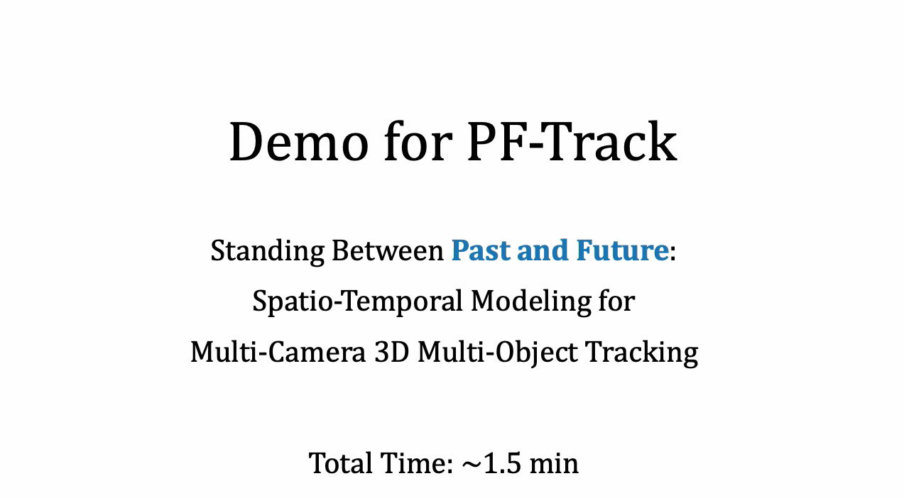

# PF-Track: an End-to-end Multi-camera 3D MOT Method

This is the official implementation of paper "Standing Between Past and Future: Spatio-Temporal Modeling for Multi-Camera 3D Multi-Object Tracking." It effectively conducts spatio-temporal reasoning via **past and future reasoning**. Compared to prior approaches, we **decrease ID-Switches by several times** on nuScenes. 

Please check our demo video.

We are waiting for the legal team of the company to go through the paperworks for open-source. Please stay tuned.
